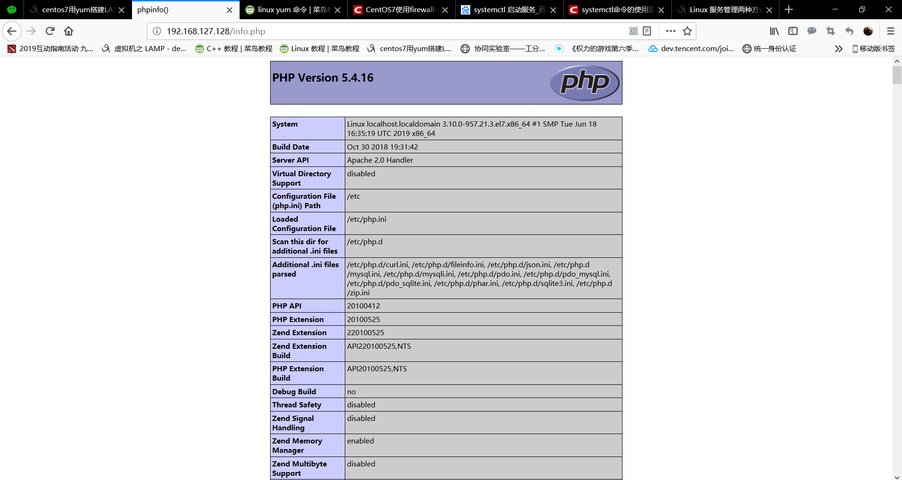

# 2019/7/4  
## Linux学习  
* LAMP环境的搭建  
    1. Apache搭建  
    　　主要指令：`yum install httpd httpd-devel`  
    　　搭建成果：  
    

    
    
  

    2. Mysql搭建  
    　　主要指令：`yum install mariadb mariadb-server mariadb-libs mariadb-devel`  
    　　搭建成果：  
    

    
    
  

    3. PHP搭建  
    　　主要指令：  
    　　安装php：`yum -y install php`  
    　　安装php与mysql的链接：`yum install php-mysql`  
    　　安装php常用模块：`yum install -y php-gd php-ldap php-odbc php-pear php-xml php-xmlrpc php-mbstring php-snmp php-soap curl curl-devel php-bcmath`  
	　　搭建成果：  
    

    
    
  
    
* 基础知识  
    1. Vim  
    　　`:r` 文件名 导入文件到当前文件中  
    　　`:!which` 命令 找到命令存放位置  
    　　`:r !` 命令 将命令结果导入当前编辑的vim之中  
    　　`:map Ctrl+v+p I#<ESC>` 指定操作定制快捷键，此时回到文档按Ctrl+p即可快速注释  
    　　`:map Ctrl+v+b 0x` 指定0x操作，Ctrl+b即可快速删除注释  
    　　`:set nu` 在vim中显示行号  
    　　`:a,bs/^/#/g` a-b行不加以确认的添加注释  
    　　`:a,bs/^#//g` a-b行不加以确认的删除注释  
    　　Vim中`/`前使用“`\`”转义符  
    　　`:ab` a b在vim中输入a变成b  
    　　以上此设定用vim写入用户家目录下.vimrc配置文件可保证重启不失效  
    2. 手工软件安装包管理  
    　　理解源码包与二进制包 **（即是centOS中rpm包）** 的区别，了解二者分别的优缺点。  
    　　学习`rpm`包的命名规则 **（包名-版本-发布次数.OS平台.硬件平台.rpm）**，利用<https://www.rpmfind.com>网站解决`rpm`库依赖的问题，由于`rpm`依赖性问题严重，所以引出`yum`在线下载 **（或本地光盘）** 解决依赖问题，这里也体现出centOS的好处：`yum`由社区维护，从而免费下载。`rpm`指令常用来`-q`查询包的安装状态以及利用，例如使用`rpm -qa|grep httpd`来查询所有已安装的包中apache的包是否正确安装，另外常用`-i`查询安装包的信息。  
    　　学习利用`rpm2cpio`解决安装文件缺失问题。  
## C++
* 学习内容  
    　　复合类型，学习读入字符串时`cin`、`cin.get`、`cin.getline`几种用法。  
    　　主要特性：`cin`不能将空格读入字符串，会将空格两边的内容读成两个字符串，`cin.getline`会智能的读取一行字符串并且把回车符更换成`/0`，`cin.get`不会处理回车符，而是读入到回车符为止，将回车符留在队列中，这就会导致第二次使用`cin.get`时直接遇到回车符认为是空字符串结束读取，解决方法是在两个`cin.get`之间加一个`cin.get()`以起到和回车符抵消的作用，`cin.get`看似没有`cin.getline`智能，实际上却可以通过检测队列中第一位是否是回车符从而判断是否读入了全部字符串而不是数组已满导致存储了一部分字符串，`cin.getline`起不到相同作用。  
* 学习进度  
    　　页码 **（81p/936p）**  
## 计算机网络
* 学习内容  
    　　深入理解VMware虚拟机中桥接、仅主机、NAT三种模式。  
    　　其中桥接主要思想是物理机与虚拟机之间建立虚拟网桥，主要优点是简单，主要缺点是占用ip地址资源。  
    　　NAT模式主要思想是建立虚拟Vmnet8交换机，虚拟机连接在虚拟交换机上，虚拟交换机链接物理机的虚拟网卡VMware Network Adapter VMnet8上，这一部分仅仅为了虚拟机和物理机之间的通讯，而实际上虚拟机之所以能联网是因为连接了虚拟NAT设备，虚拟NAT设备再连接到主机物理网卡上，从而可以上网，这么做的好处就是虚拟机可以不和物理机共享网段，从而不占用ip资源。  
    　　仅主机模式主要思想是将虚拟机网卡直接与物理网卡连接，去除NAT设备的NAT模式，在NAT模式下禁用虚拟网卡只会导致主机和虚拟机之间无法通信，但是虚拟机仍然可以上网，然而在主机模式下禁用虚拟网卡会导致虚拟机与主机和网络均失联。  
	　　另外，在后两者的虚拟网络下，均存在虚拟DHCP服务器，可以为虚拟机的虚拟网段提供动态ip分配，而在桥接模式下就需要看物理机所在网段是否有动态ip分配的功能了。  
* 学习进度  
    　　课时 **（17p/95p）**  
    　　当前进度：奈氏准则与香农公式  

# 2019/5/14~2019/7/3
## Linux学习（菜鸟教程，兄弟连基础视频）
* 学习指令前的准备操作
    1. 虚拟机的安装  
    　　使用VMware安装centOS7.0，并利用`yum`指令安装图形界面，使用`init`指令实现图形界面与非图形界面之间的切换。  
    2. 远程控制的配置  
    　　利用`vim`配置`ifcfg-eth0`文件 **（更名并配置静态ip、mac地址、网关、DNS等参数的配置）**，并配置`sshd_config`文件，重新启动网络服务以及ssh服务，安装Xshell并且建立虚拟机与Xshell的链接从而实现远程登录管理。  
* 基础指令学习历程  
    1. 文件处理命令  
    　　通过`ls`指令查看目录下内容以及root、所在组、用户分别对其的权限 **（rwx）**，长显示短显示以及显示隐藏文件，学习通过长显示判断目录下内容类型 **（软硬连接，目录，文件）**，并且利用`ln`指令生成软连接。  
    　　通过`mkdir`创建目录，`cd`切换当前目录，`pwd`显示当前目录，`rmdir`删除空目录并可以递归删除空目录，`cp`复制，`mv`剪切更名，`rm`删除，`touch`创建空文件。  
    　　利用不同方式浏览文件：`cat`**（正常看）**、`tac`**（反着看）**、`more`**（向下翻页）**、`less`**（双向翻页）**、`head`**（从头浏览）**、`tail`**（从尾浏览）**。实操中发现只有在虚拟机中才需要更高级的浏览文件指令，而在Xshell中只需要`cat`指令即可完成自由翻页，浏览文件。  
    2. 权限管理命令  
    　　通过`chmod`更改文件或目录权限、`chown`更改其权限所有者、`chgrp`更改其所属组、`umask`显示缺省权限。  
    3. 文件搜索命令  
    　　通过`find`进行指定条件文件的搜索，`locate`进行对资料库的搜索，理解`locate`是对文件档案系统进行搜索，而不像是`find`对磁盘本身进行搜索，所以`locate`通常快于`find`，但是在未更新资料库的情况下`locate`会漏掉未更新但存在的文件，故在条件允许的情况下尽量少使用`locate`指令。除此之外学习了`which`指令-对指令所在目录进行搜索，`whereis`指令-对指令的帮助文档进行搜索，`grep`指令-对文件内指定内容进行搜索。  
    4. 帮助命令  
    　　通过man查看命令或配置文件的帮助信息，通过`help`查看shell内置命令的帮助信息，理解shell内置命令不必在磁盘上进行检索所以速度要比非shell内置指令快，例如`umask`就是shell内置指令，通过man并不能获取它的帮助文档。  
    5. 用户管理命令  
    　　通过`passwd`指令进行对某一用户的密码的设定，理解Linux设置密码的规则，并且`passwd`指令在普通用户操作时只能更改自己的密码并且需要遵守密码规则，而root管理员可以对任何用户的密码进行强制更改，即使不符合密码规则，如：111111。  
    　　通过`who`指令查看登录用户的信息，w指令查看登录用户的详细信息。  
    6. 压缩解压命令  
   　　 通过几种不同的指令对文件进行压缩，`gzip`将文件压缩成.gz文件，`gunzip`对其进行解压，`tar`指令进行对目录进行压缩；`zip`将文件压缩成.zip文件，`unzip`对其进行解压；`bzip2`将文件压缩成.bz2文件，`bunzip2`对其进行解压。  
    理解Linux与Windows下压缩文件并不是全部通用的，例如Windows中常用的rar文件不能够在Linux下正常解包  
    7. 网络命令  
    　　通过`write`实现不同在线用户之间发送信息，可任意回车换行，Ctrl+d发送；通过`wall`给所有在线用户发送广播信息；通过`ping`测试和不同ip之间的网络连通性，与Windows不同的是在Ctrl+C终止之前会一直发送64字节数据包进行测试，除非使用-c选项；通过`ip addr`理解回环网卡lo与实际网卡eth0；通过`mail`可对离线用户发送邮件；通过`last`查看所有用户登陆、重启的信息，通过`lastlog`查看所有用户最后一次登录信息；通过`traceroute`显示数据包到主机之间的路径，进行路由器结点的跟踪 **(在我们实验室实际测试时全部显示\*\*\*加密，可能是实验室路由器加密的问题)**；通过`netstat`显示网络信息，常用三种用法：`-tuln`监听网络端口从而判断各项网络服务是否开启，`-an`查看所有监听信息可以额外查看正在连接的服务器，`-rn`查询当前计算机网关；`setup`进行快速系统服务配置 **(此功能Red Hat开发，其他版本Liunx没有)**，免去了更改配置文件的麻烦；`mount`手工挂载，在指定挂载点挂载外部设备 **（挂载原理-软连接）**，`umount`取消挂载。  
    8. 关机重启命令  
    　　理解服务器在正常运行状态下不宜进行关机操作的原因，理解运行越久的服务器更加相对稳定，避免远程关机服务器的操作造成与服务器的失联无法重启。
    　　关机指令`shutdown`以及尽量不使用其他关机命令的原因，比如`poweroff`，重启指令`reboot`，其中重启指令也是`shutdown`指令中的一条，除此之外`init`也可以实现重启和关机，理解系统0-6运行级别，`runlevel`查询运行级别。退出登录当前用户指令`logout`。  
* Vim入门  
    　　理解`Vim`命令、插入、编辑三个模式，掌握`a`、`i`、`o`三个插入命令，`r`替换命令，`u`撤销命令，快速定位指定行数、行首行尾，指定行数删除剪切复制粘贴，明白在命令模式下输入：`wq！`/`q！`操作对当前文档保存退出与不保存退出。  
* 当前进度  
   　　 在熟悉Linux基础指令的条件下，碰到陌生指令进行更新学习，接触shell脚本语言，首先实现利用`echo`输出`HELLO WORLD`。接下学习中会继续针对缺漏的指令进行知识补充并熟悉操作，其次对shell脚本语言更深入的学习理解。  
   　　 LAMP环境的安装。  
## C++的复习（C++ Primer Plus，菜鸟教程）  
* 学习原因  
    　　在与学长的接触过程中了解实验室hos、cos项目使用了C++、C#、qt的知识，其中C++、C#在本科学习中都曾有学习，但是因为时长过久记忆模糊，学习教材质量一般，细节部分很多含糊不清，决定再次读一遍C++的基础，可以在未来遇到问题时节省时间，故决定在现在有时间时学习C++ Primer Plus，在这一计划完成后（或同步）进行C#和qt的学习。  
* 当前进度  
    　　页码进度 **（71p/936p）**，当前学习章节：复合类型。  
## 计算机网络（韩立刚）  
* 学习原因  
    　　实验室很多项目是与网络有关的方向，在考研初试中考试科目是操作系统与数据结构，复试准备过程中计算机网络的知识记忆性偏多，准备仓促，再加上本科学习这门课时间久远记忆模糊，决定找一个和工程角度相关较多的网课夯实基础，从而期望在项目中遇到网络相关问题时能够顺利解决。  
* 当前进度  
    　　课时 **（资源原因更换视频）** **（13p/95p）**，  
    　　当前学习章节：虚拟机的网络设置。  
* 当前问题  
    　　针对自己选择方向语言和工程实现方面的深入了解。  
