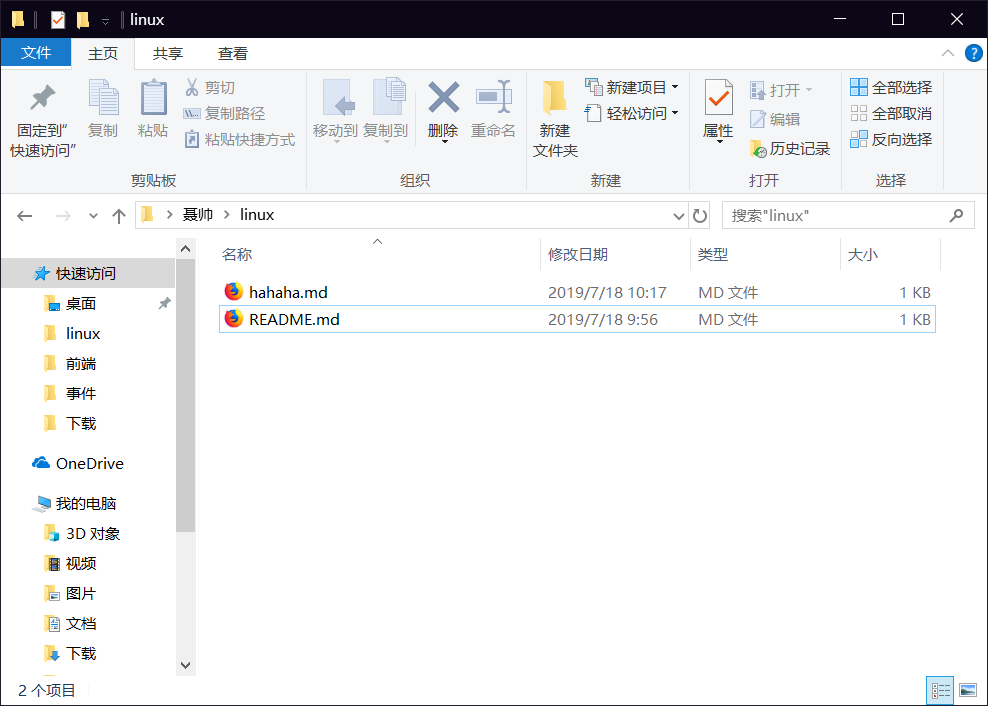
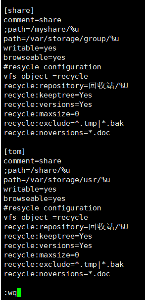
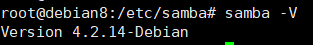

# 2019/7/19
## git
* 学习文档的迁移
## 实验室任务
* 参与讲座
* 参与测试
# 2019/7/18
## git
* 管理修改  
    &emsp;&emsp;`git commit`指令只负责将暂存区中的内容提交到master，所以在`git add`文件后再对工作区文件进行修改，然后再commit则对最新修改的内容无效。`git diff HEAD -- readme.txt`命令可以查看工作区和版本库里面最新版本的区别。  
    

    
    

	&emsp;&emsp;所以说应该用`git add`增加全部改动后再统一用`git commit`指令。  
* 撤销修改  
    &emsp;&emsp;使用`git checkout -- <file>`指令可以使工作区中内容直接回退到master区最新版本：  
    

    
    

	&emsp;&emsp;命令`git checkout -- readme.txt`意思就是，把readme.txt文件在工作区的修改全部撤销，这里有两种情况：一种是readme.txt自修改后还没有被放到暂存区，现在，撤销修改就回到和版本库一模一样的状态；一种是readme.txt已经添加到暂存区后，又作了修改，现在，撤销修改就回到添加到暂存区后的状态。  
    &emsp;&emsp;总之，就是让这个文件回到最近一次`git commit`或`git add`时的状态。  
    &emsp;&emsp;`git checkout`先参考暂存区，再参考master区，假如错误的文件已经提交到暂存区，需要将工作区的修改撤销，可以使用之前学到的`git reset`指令，` git reset HEAD <file>`可以直接回退到最新版本。  
* 删除文件  
    &emsp;&emsp;`rm`指令可以删除工作区指定文件，之后想删除版本库中的相同文件需要删除的话使用`git rm`再`git commit`即可：  
    

    
    

    
	&emsp;&emsp;新建一个测试删除md文件。  
    

    
    

	&emsp;&emsp;如图将新建文件提交到master。  
	&emsp;&emsp;开始删除master文件测试：  
    

    
    

 
    

    
    

	&emsp;&emsp;使用`git log`查询，如图，已经成功将文件从master删除。  
* SSH KEY  
    &emsp;&emsp;第一步，创建SSH KEY：  
    

    
    

	&emsp;&emsp;在主目录下成功生成了SSH目录：  
    

    
    

    &emsp;&emsp;其中SSH目录里面有id_rsa和id_rsa.pub两个文件，这两个就是SSH Key的秘钥对，id_rsa是私钥，不能泄露出去，id_rsa.pub是公钥，可以放心地告诉任何人。  
    &emsp;&emsp;第二步，在GitLab提交ssh key：  
    

    
    

	&emsp;&emsp;在GITLAB中个人设置中SSH KEY设置项中输入自己的id_rsa.pub文件的内容。  
    

    
    

	&emsp;&emsp;成功添加ssh key，添加ssh key的目的是服务器可以识别是你本人计算机在修改库的数据，不允许其他人对其进行修改，如果换一台电脑的话要额外添加新的ssh key。  
* 添加远程仓库  
    &emsp;&emsp;新建一个远程仓库：  
    

    
    

	&emsp;&emsp;在本地链接远程库：  
    

    
    

    
	&emsp;&emsp;使用`git push`指令将本地master文件上传到远程库：  
	&emsp;&emsp;第一次推送master分支时，加上了`-u`参数，Git不但会把本地的master分支内容推送的远程新的master分支，还会把本地的master分支和远程的master分支关联起来，在以后的推送或者拉取时就可以简化命令。  
    

    
    

	&emsp;&emsp;然后检查gitlab，发现所有本地文件成功同步，可喜可贺。  
    

    
    

	&emsp;&emsp;从现在起，只要本地作了提交，就可以通过命令：`git push origin master`把本地`master`分支的最新修改推送至GitLab！  
## 计算机网络
* 二进制指数类型退避算法  
    &emsp;&emsp;应用在数据链路层广播信道中载波监听多路访问（CSMA/CD）时产生冲突的解决算法，简单来说核心思想就是某机器一旦发生一次冲突，就随机生成一个与监听时间成倍率的等待时间，等待时间后再次重传，且每一次冲突都会使此机器与监听事件相乘的倍率可选取随机数范围值越大，随机选取倍率数值大的可能性越高，奉行“越冲突，越往后排，给其他机器让路”的思想。  
* 以太网  
    &emsp;&emsp;以太网是局域网的一种，是总线型的局域网，能够应用CSMA/CD技术的都是以太网，以太网是一种局域网技术，说的通俗点，以太网就是交通路道，CSMA/CD就是在以太网上工作的交通警察，解决冲突。局域网的数据链路层有两个子层：逻辑链路控制子层（LLC）与媒体接入控制子层（MAC），不过现在很多厂商生产网卡仅装有MAC协议。  
    &emsp;&emsp;以太网不可靠交付，出错丢掉，不纠错。使用的设备：集线器，只起到放大信号的作用，集线器本身就是一堆网线的集合，将每台机器的出口对到另外其他所有机器的入口上，没有任何应用技术，工作在物理层，而且还不安全，因为集线器是广播传播数据，abc通过集线器连在一起，a发给b的信息可以被c捕获。  
    &emsp;&emsp;理解信道利用率，主要影响信道利用率的是检测时间，检测时间越小传送数据时间比重在总时间中比重越大，信道利用率越高。  
* MAC地址  
    &emsp;&emsp;mac地址是一个48位的二进制地址，理论上可以拥有248个不同的mac地址，网卡生产厂家要做到每一块网卡的mac地址都不同，所以他们要找IEEE的注册管理机构RA申请高位三个字节（24）位的地址号，我们看到的mac地址通常是16进制的12位数形式，计算机中无线网卡和有线网卡都有各自的mac地址。  
    学习mac帧的组成：  
    

    
    

    &emsp;&emsp;mac帧抓包工具：Ethereal，若计算机已经收到mac帧说明数据无误，FCS部分就会被计算机自动删除。目标mac地址全f说明这个mac帧是广播帧。  
* 当前进度  
    &emsp;&emsp;课时（33p/95p） 数据链路层。  
## 转移学习文档
&emsp;&emsp;整理markdown格式的学习文档。  
***
# 2019/7/17
## git
* 选定学习教程  
    &emsp;&emsp;教程地址：<https://www.liaoxuefeng.com/wiki/896043488029600>  
* 创建版本库  
    &emsp;&emsp;新建Linux库目录：  
    

    
    

	&emsp;&emsp;git默认根目录为user下的用户目录，完成指令后会在用户目录下生成对应的库目录。  
	&emsp;&emsp;我的电脑上生成库目录路径为C:\Users\Administrator\linux  
    

    
    

    &emsp;&emsp;输入`git init`指令，现在linux目录变成了可以管理的仓库，生成对应`.git`目录，这个目录是Git来跟踪管理版本库。  
    

    
    

	&emsp;&emsp;word文件是二进制编码的，git无法追踪，应该用记事本这种存储UTF-8编码的应用存储文档，但是微软自带的记事本会在每个文件开头添加`0xefbbbf`（十六进制）的字符，会产生各种不可思议的bug，故不要用windows下的记事本软件。我这里使用Visual Studio Code进行markdown文件的编写。  
	&emsp;&emsp;在linux目录下新建第一个markdown文档：  
    

    
    

    &emsp;&emsp;接下来把README.md文件添加到仓库：  
    

    
    

	&emsp;&emsp;把README.md文件提交到仓库：  
	&emsp;&emsp;其中`-m`后跟的字符是作者自己对本次提交的说明，`-m`是个好习惯不建议省去。  
    

    
    

	&emsp;&emsp;成功添加后显示如下结果，其中`file changed`是文件改动数目，`insertion`是文件插入了几行内容。  
	&emsp;&emsp;之所以要先`add`再`commit`的原因是`add`指令可以添加多个文件，`commit`指令将它们全部一次性提交。  
* 时光机  
    &emsp;&emsp;更改README.md文件：  
    

    
    

    &emsp;&emsp;效果：  
    

    
    

	&emsp;&emsp;运行`git status`查看修改过文档的状态是怎样的：  
    

    
    

	&emsp;&emsp;如图，其中显示未将更改进行提交，现在使用`git diff`命令看看是哪里曾经进行过修改：  
    

    
    

	&emsp;&emsp;其中加号显示了文件新增的内容，这回确认了之后提交内容到仓库就放心多了，之后再`add`和`commit`两板斧操作就行了。  
	&emsp;&emsp;输入`git add`再检查文件状态：  
    

    
    

    &emsp;&emsp;显示将要修改的文件只README.md文件，之后就可以放心提交了：  
    

    
    

	&emsp;&emsp;会显示库文件的增删行数。  
    

    
    

    &emsp;&emsp;现在再输入`git status`可显示工作区文件无改动并且工作区任务已经完毕。  
* 版本回溯  
    &emsp;&emsp;使用git log指令查看文件的历史版本：  
    

    
    

	&emsp;&emsp;可以看到每次版本更新的提交说明，更改者以及更改时间。  
	&emsp;&emsp;加上`--pretty=oneline`指令可以只显示版本号以及改动说明，比较直观：  
    

    
    

	&emsp;&emsp;git中，`HEAD`指向的是当前版本，`HEAD^`指的是上个版本，`HEAD^^`指的是上上个版本……但很久远的版本，比如100个版本，写成HEAD~100。  
	&emsp;&emsp;接下来使用版本回退指令：`git reset`  
    

    
    

	&emsp;&emsp;如图，使用`git reset`指令将文件回滚到上个版本，又将文件恢复到当前版本，可以指定特定版本号进行回溯，只需要输入部分版本号，不需要将版本号全部输入进去。但是有歧义不可以，要再输入几位区分歧义。  
	&emsp;&emsp;回溯原理是git内部有几个版本文件，HEAD指针指向了旧的版本文档顺便更新工作区。  
	&emsp;&emsp;`git reflog`指令可以查询每一次命令，从而可以查到`commit id`，通过`id`可以回溯到误删的最新版本。  
    

    
    

* 工作区与暂存区  
    &emsp;&emsp;直接工作的区域就是工作区，如我的电脑中linux目录下就是一个工作区。  
    

    
    

	&emsp;&emsp;如图，每次`git add`时就是讲文件放入stage暂存区，`git commit`时是将暂存区所有文件提交到对应的文件分支。一旦`git commit`后暂存区内容将清空，工作区与master区内容相同，工作区就是“干净”的，git没有遗留未处理的任务。  
## 实验室任务  
&emsp;&emsp;统计实验室服务器CPU参数。  
***
# 2019/7/16
## git
* 了解并配置git  
&emsp;&emsp;GIT是基于分布式思想的版本控制系统，而SVN这种不是，所以GIT文件能减少特殊情况对文件的破坏。  
选用Windows作为生产工具系统，Windows端安装git软件相对比较简单，傻瓜式安装。理解工作区，暂存区和版本库。  
&emsp;&emsp;安装完成界面：  
    

    
    

## 计算机网络
* CSMA/CD协议的冲突检测  
&emsp;&emsp;CSMA/CD协议不能使用全双工通信，只能使用半双工通信，原因就是此协议需要检测碰撞（原理就是碰撞后叠加的电波大于5v），使用全双工的话就无法碰撞，自然也就无法检测碰撞。由于半双工CSMA/CD协议会变相缩减网络带宽。windows网卡配置里可以设置全双工和半双工。  
&emsp;&emsp;争用期：说通俗些就是从计算机A到计算机B来回往返检测用掉的时间，这段时间发送的是前64字节数据。若这64字节内未冲突，则后续就不会发生冲突。之所以是64字节是因为对于10Mb/s的以太网争用期内可发送64字节，同样的数据包小于64字节的话可能会导致检测不到冲突，所以以太网有效帧长度为64字节，小于64字节就是无效帧。网速越快有效帧长度越长、同理网线越长往返时间越长，有效帧长度越长，所以以太网网线长度有规定不能太长。  
* 当前进度  
&emsp;&emsp;课时（29p/95p） 数据链路层。  
***
# 2019/7/15
## Linux
* 当前进度  
&emsp;&emsp;复习Linux基础知识。  
## C++
* 几种不同的字符串编码方式  
* 正常的字符char拥有8位大小的存储空间，理解`wchar_t`，`char16_t`，`char32_t`和它们的使用方式。  
* 当前进度  
&emsp;&emsp;页码（89/936p） 完成字符串的学习。  
## 计算机网络  
* 当前进度  
&emsp;&emsp;课时（28p/95p） 数据链路层。  
***
# 2019/7/13
## Linux
&emsp;&emsp;复习安装配置虚拟机的知识，详情见《本地虚拟机搭建Linux系统》。  
## 实验室任务
&emsp;&emsp;参与实验室HOS的pdf翻页测试。  
***
# 2019/7/12
## Linux
* 当前进度  
&emsp;&emsp;撰写配置VMware Workstation Pro，安装虚拟器，配置静态ip，并连接Xshell的文档。  
## MarkDown
* 环境配置：  
    1. Visual Studio Code  
    2. 火狐浏览器扩展：GitLab Markdown Viewer  
* 学习历程：  
    1. 代码展示：  
    

    
    

    

    
    

    
    

    
    

    
    

    
    

    2. 效果展示：  
    

    
    

    
    

    
    

    
    

    
    

    
    

    
    

    

    
    

***   
# 2019/7/11
## Linux
* 错误分析  
&emsp;&emsp;对比新旧两份配置文件：  

&emsp;&emsp;第一份配置文件时`path`指向的是`usr`目录，而真正包含tom用户目录的是`share`目录，`share`目录是`usr`目录下的软连接，所以用户文件未能正确对应，故更改文件体系，建立`/smbmount`目录作为挂载目录，在根目录下建立`/share`作为实际存写目录，再将`/share`的软连接写入`/smbmount`目录，`/smbmount/share/%u`作为\[tom\]共享的识别路径，其中`%u` 代表一个URL。也可以是一个本地文件路径，`%U` 代表一系列URL，其中每一个URL作为一个单独的参数传递给可执行程序，也可以是一系列本地文件路径。此时在windows上可以正确识别`tom`文件夹并挂载，并且可以正确进行读写：  

* 回收站配置无效分析  
&emsp;&emsp;经过排查，得出结论，回收站文件夹需要用户自主创建，不是根据配置文档自动生成。  
&emsp;&emsp;效果演示：  

 

&emsp;&emsp;如图实现了垃圾箱的配置，实现了回收站功能！  
* 结语：完成配置要求  
&emsp;&emsp;重新审视配置要求：  

&emsp;&emsp;其中：  
1. 要求共享目录唯一，所有的文件共享均归属于`tom`目录下，实现了共享目录唯一。  
2. 挂载目录为根目录下`/smbmount`中`share`软连接，而实际存储目录是根目录下`/share/tom`目录。  
3. 根据配置文件已经实现回收站的配置，回收站直接位置为相对`share`目录下回收站。  
4. 根据配置文件将实现回收站功能的文件夹更名成“回收站”。  
## 计算机网络
* CRC冗余检验  
&emsp;&emsp;在数据包后三位加上000，和进行P（除数）进行模2除法，得到新的三位余数，新的三位余数替换掉000，产生新的数据包，新的数据序列在检验时和P进行模二除法如果余数是000说明没有产生错误，可以保留，如果出现错误则丢弃。  
但CRC无法追寻到数据序列出错处是哪里，没有矫错能力。  
* PPP协议  
&emsp;&emsp;数据链路层上的协议，它支持多种网络层协议，通过查看封装帧帧首与帧尾是否是7E即可辨识PPP协议，首部由于是点对点，所以地址段是FF，02字段无意义，协议字段表明了信息部分是什么类型的数据，尾部FCS字段作为信息的检验字段。  
&emsp;&emsp;PPP协议也涉及到透明传输的问题，解决方法是将7E拆成7D和5E，这样IP数据包部分就不存在会产生误会的7E了，这样也保证了传输数据还是8的倍数，如果传输的是二进制流，则每发现五个1则插入一个0，接收时每5个1则删除后续的0。  
&emsp;&emsp;PPP协议支持身份验证，并且只能保证丢弃错误数据，其他不管，PPP协议多用于拨号上网。  
&emsp;&emsp;学习计算机网络可以用Cisce Packet Tracer软件模拟网络。  
* CSMA/CD  
&emsp;&emsp;载波监听多点接入技术利用了广播通讯，避免了多台计算机在局域网内使用物理层分频/分时的复用技术，主要思想是监听其他计算机是否还在通讯，避免和其他计算机之间的冲突。  
* 当前进度  
&emsp;&emsp;课时（28p/95p）数据链路层  
***
# 2019/7/10
## Linux
* Samba的配置  
&emsp;&emsp;配置文件目录：/etc/samba/smb.conf，`vim`打开后进行配置：  

&emsp;&emsp;其中各项参数：  
&emsp;&emsp;`comment`：对该共享的描述。  
&emsp;&emsp;`path`：共享目录路径。  
&emsp;&emsp;`writable`：共享路径是否可写。  
&emsp;&emsp;`browseable`：共享是否可以浏览。  
&emsp;&emsp;`vfs object=recycle`：载入回收站模块`recycle.so`  
&emsp;&emsp;`recycle:repository` ：回收站相对路径  
&emsp;&emsp;`recycle:keeptree`：删除文件时，是否保存原有文件夹层级结构。  
&emsp;&emsp;`recycle:version`：删除文件时，遇到同名文件是否启用版本号功能。  
&emsp;&emsp;`recycle:maxsize`：回收站最大空间，0表示不限制  
&emsp;&emsp;`recycle:exclude`：删除文件时，这些类型文件不会加入回收站。  
&emsp;&emsp;`recycle:noversions`：如果遇到这个尅性同名文件则直接覆盖。  

&emsp;&emsp;建立共享目录：  
&emsp;&emsp;`mkdir /var/storage`然后在其相对目录下`mkdir uses`、`mkdir group`  
&emsp;&emsp;建立Linux新用户tom，建立Samba新用户tom，给tom设置samba密码，密码为111111。  

&emsp;&emsp;在share组中加入用户tom：  

&emsp;&emsp;创建个人存储目录：  

&emsp;&emsp;创建组存储目录：  

&emsp;&emsp;创建samba挂载目录到个人存储目录的软连接：  

&emsp;&emsp;创建samba挂载目录到群组存储目录的软连接：  

&emsp;&emsp;重启samba出现问题：  

&emsp;&emsp;使用samba工具`testparm`检测配置文件：  

&emsp;&emsp;除错，消除错误参数：  

&emsp;&emsp;重启samba成功：  

&emsp;&emsp;从windows挂载目录：  

&emsp;&emsp;安全问题出错：  

&emsp;&emsp;更改win10安全策略：  

&emsp;&emsp;解决问题，登录：  

&emsp;&emsp;出现权限问题：  

&emsp;&emsp;打开windows中smb功能。  

&emsp;&emsp;配置失败，排除所有原因分析得出是`smb.conf`仍旧有错误，重新撰写，更新配置文件：  

&emsp;&emsp;配置成功，可以正常访问服务器。  

&emsp;&emsp;当前进度：完成回收站的配置，分析之前配置文件错误原因。
***
# 2019/7/9
## Linux
* 源代码安装Samba  
    &emsp;&emsp;遇到问题：`E: Package 'libgpgme-dev' has no installation candidate`  
    

    
    
 

	&emsp;&emsp;解决方法：更换香港下载源，重新`update`，重新`upgrade`。解决结果：失败。  
	&emsp;&emsp;放弃源码安装Samba，使用`aptitude`安装  
    

    
    

	&emsp;&emsp;安装成功。  
    

    
    
 

* 配置Samba  
    &emsp;&emsp;Samba配置文件默认目录：/etc/samba/smb.conf  
	&emsp;&emsp;当前进度：阅读Samba配置文件  
## 计算机网络
* CRC检验技术的二进制算法  
    &emsp;&emsp;理解模2加减乘除法的原理，核心思想是异或，与普通二进制除法区别：  
    

    
    

***
# 2019/7/8
## Linux
* 源代码安装Samba  
    &emsp;&emsp;重新安装`python3`后解决了`python`依赖项问题。
    

    
    

	&emsp;&emsp;出现新的报错信息`Samba AD DC and --enable-selftest requires lmdb 0.9.16 or later`  
	&emsp;&emsp;解决方法：下载`lmdb`、`lmdb-devel`，结果：失败，`apt-get`显示没有这个包。解决失败。  
	&emsp;&emsp;重新全部推倒重做：仔细审查官网找到所有依赖项，把之前全部安装的包卸载重装。  
    &emsp;&emsp;官网网址：<https://wiki.samba.org/index.php/Package_Dependencies_Required_to_Build_Samba>  
    &emsp;&emsp;依赖项：
    

    
    

	&emsp;&emsp;逐一安装依赖项并重新configure。  
***
# 2019/7/6
## Liunx
* Debian下的samba源码安装  
    1. 安装要求：  
    

    
    
  

    2. 安装过程中出现的问题  
    &emsp;&emsp;- `./configure`过程中最后报错  
    

    
    

    
    &emsp;&emsp;根据配置日志推断是python依赖项出现了问题，此时已安装过最新版本的python。  
    

    
    

    
	&emsp;&emsp;源代码目录下有install_with_python.sh的python运行脚本文件，运行后报错。  
    

    
    

    
	&emsp;&emsp;就缺少Python.h文件问题进行修复。  
    &emsp;&emsp;因此步骤卡住了几个小时未能解决，此段为向李旭云学长求助，学长提供思路并解决：  
	百度报错条目：  
    `err: ../../test.c:431:20: fatal error: Python.h: No such file or directory`  
    &emsp;&emsp;得到网上帮助信息：https://blog.csdn.net/zzzcl112/article/details/81542513  
    &emsp;&emsp;解决方案：  
    `sudo apt-get install python-dev`  
    `sudo apt-get install python3-dev`  
    &emsp;&emsp;解决后可正常编译。  
    

    
    

    
    &emsp;&emsp;运行 `./configure  --prefix=/usr/local/` 进行安装路径设置。  
## C++
* string类  
    &emsp;&emsp;string类很多方面使用方式与字符数组相同，主要区别就是对于string可以进行直接简单变量声明，数组是容器，string是实体，string会根据输入的字符串长度进行自我调整。string类要比使用字符数组更加自由、智能，比如字符数组无法从数组A赋值给数组B，但是string类可以，还可以轻松地进行拼接等操作。  
* 当前进度  
    &emsp;&emsp;页码（86p/936p）  
## 计算机网络
* 物理层  
    &emsp;&emsp;学习各种有线和无线通信原理，理解集线器是一个冲突域，集线器是物理设备的原因。  
    &emsp;&emsp;理解信道复用技术中的频分复用技术、时分复用技术（利用率不高的原因），统计时分复用，波分复用（原理同频分复用），理解E1标准和T1标准，一个码元能够带8位信息的原因，国内只有E1标准电路。  
    &emsp;&emsp;理解ADSL拨号上网，猫其实是调制解调器，电话占据低频频段，网络利用高频频段。由于DMT调制技术的原因，电话用1个信道，上传分配25个子信道，下载分配249个子信道，故上传速率比较低。理解HFC上网光纤同轴线混用的原理（利用有线电视网络）。理解FTTx光纤到户上网。物理层章节结束。  
* 实验  
    &emsp;&emsp;理解交叉电缆和直通电缆的区别和应用场景，利用电缆和水晶头制作一根直通电缆。  
* 当前进度  
    &emsp;&emsp;课时 **（23p/95p）** 数据链路层  
***
# 2019/7/5
## Linux学习
* `yum`指令  
    　　centOS7.0可以通过配置文件设置静态网络ip，也可以通过nmtui界面配置网络。慎用`yum -y update`，这会导致内核升级，远程无法再次正常连接至服务器。慎用`yum`卸载，`yum`卸载可能会导致其他软件依赖的包被卸载，其他软件无法正常使用，所以Liunx使用原则：尽量最小化安装，尽量避免卸载，卸载也避免使用`yum`卸载。  
* 源码包管理  
    　　rpm包在安装时候软件包会自动选择默认路径进行安装，但是源码包不一样，源码包需要自己手动选择安装路径，一般安装在“/usr/local/软件名”下。rpm包在安装之后启动文件默认存储在/etc/rc.d/init.d/下，red hat公司开发了 **“`service 启动项 start`”** 指令简化了过长的绝对路径启动命令，`service`指令其实就是去系统默认启动项目录去找指定启动项，所以`service`指令无法管理源码包的启动，源码包进行启动时只能用绝对路径启动方式。  
    　　系统为源代码的存放准备了位置：/usr/local/src/，传送源代码包使用WinSCP，源码包安装步骤：  
    1. 下载、传输、解压压缩包。**（使用WinSCP工具）**  
    2. 进入解压缩目录。  
    3. INSTALL是安装说明，README是使用说明，可以用来阅读安装说明。  
    4. `./configure`软件配置与检查，`./configure  --prefix=/usr/local/名称` 来配置安装位置。  
    5. `./configure`会把用户定义的配置和系统环境写进Makefile文件。  
    6. 完成`./configure`命令后检查报错。  
    7. `make`指令 编译，`make install`指令 编译安装。  
* 脚本安装包  
    　　脚本安装包不是独立软件包类型，并且是源码包。  
* 当前进度  
    　　接下来在Debian8下使用源码安装方式安装samba。  
## 计算机网络
* 当前进度  
    　　课时 **（19p/95p）**  
## C++
* 练习习题
    

    
    

***
# 2019/7/4  
## Linux学习  
* LAMP环境的搭建  
    1. Apache搭建  
    　　主要指令：`yum install httpd httpd-devel`  
    　　搭建成果：  
    

    
    
  

    2. Mysql搭建  
    　　主要指令：`yum install mariadb mariadb-server mariadb-libs mariadb-devel`  
    　　搭建成果：  
    

    
    
  

    3. PHP搭建  
    　　主要指令：  
    　　安装php：`yum -y install php`  
    　　安装php与mysql的链接：`yum install php-mysql`  
    　　安装php常用模块：`yum install -y php-gd php-ldap php-odbc php-pear php-xml php-xmlrpc php-mbstring php-snmp php-soap curl curl-devel php-bcmath`  
	　　搭建成果：  
    

    
    
  
    
* 基础知识  
    1. Vim  
    　　`:r` 文件名 导入文件到当前文件中  
    　　`:!which` 命令 找到命令存放位置  
    　　`:r !` 命令 将命令结果导入当前编辑的vim之中  
    　　`:map Ctrl+v+p I#<ESC>` 指定操作定制快捷键，此时回到文档按Ctrl+p即可快速注释  
    　　`:map Ctrl+v+b 0x` 指定0x操作，Ctrl+b即可快速删除注释  
    　　`:set nu` 在vim中显示行号  
    　　`:a,bs/^/#/g` a-b行不加以确认的添加注释  
    　　`:a,bs/^#//g` a-b行不加以确认的删除注释  
    　　Vim中`/`前使用“`\`”转义符  
    　　`:ab` a b在vim中输入a变成b  
    　　以上此设定用vim写入用户家目录下.vimrc配置文件可保证重启不失效  
    2. 手工软件安装包管理  
    　　理解源码包与二进制包 **（即是centOS中rpm包）** 的区别，了解二者分别的优缺点。  
    　　学习`rpm`包的命名规则 **（包名-版本-发布次数.OS平台.硬件平台.rpm）**，利用<https://www.rpmfind.com>网站解决`rpm`库依赖的问题，由于`rpm`依赖性问题严重，所以引出`yum`在线下载 **（或本地光盘）** 解决依赖问题，这里也体现出centOS的好处：`yum`由社区维护，从而免费下载。`rpm`指令常用来`-q`查询包的安装状态以及利用，例如使用`rpm -qa|grep httpd`来查询所有已安装的包中apache的包是否正确安装，另外常用`-i`查询安装包的信息。  
    　　学习利用`rpm2cpio`解决安装文件缺失问题。  
## C++
* 学习内容  
    　　复合类型，学习读入字符串时`cin`、`cin.get`、`cin.getline`几种用法。  
    　　主要特性：`cin`不能将空格读入字符串，会将空格两边的内容读成两个字符串，`cin.getline`会智能的读取一行字符串并且把回车符更换成`/0`，`cin.get`不会处理回车符，而是读入到回车符为止，将回车符留在队列中，这就会导致第二次使用`cin.get`时直接遇到回车符认为是空字符串结束读取，解决方法是在两个`cin.get`之间加一个`cin.get()`以起到和回车符抵消的作用，`cin.get`看似没有`cin.getline`智能，实际上却可以通过检测队列中第一位是否是回车符从而判断是否读入了全部字符串而不是数组已满导致存储了一部分字符串，`cin.getline`起不到相同作用。  
* 学习进度  
    　　页码 **（81p/936p）**  
## 计算机网络
* 学习内容  
    　　深入理解VMware虚拟机中桥接、仅主机、NAT三种模式。  
    　　其中桥接主要思想是物理机与虚拟机之间建立虚拟网桥，主要优点是简单，主要缺点是占用ip地址资源。  
    　　NAT模式主要思想是建立虚拟Vmnet8交换机，虚拟机连接在虚拟交换机上，虚拟交换机链接物理机的虚拟网卡VMware Network Adapter VMnet8上，这一部分仅仅为了虚拟机和物理机之间的通讯，而实际上虚拟机之所以能联网是因为连接了虚拟NAT设备，虚拟NAT设备再连接到主机物理网卡上，从而可以上网，这么做的好处就是虚拟机可以不和物理机共享网段，从而不占用ip资源。  
    　　仅主机模式主要思想是将虚拟机网卡直接与物理网卡连接，去除NAT设备的NAT模式，在NAT模式下禁用虚拟网卡只会导致主机和虚拟机之间无法通信，但是虚拟机仍然可以上网，然而在主机模式下禁用虚拟网卡会导致虚拟机与主机和网络均失联。  
	　　另外，在后两者的虚拟网络下，均存在虚拟DHCP服务器，可以为虚拟机的虚拟网段提供动态ip分配，而在桥接模式下就需要看物理机所在网段是否有动态ip分配的功能了。  
* 学习进度  
    　　课时 **（17p/95p）**  
    　　当前进度：奈氏准则与香农公式  
***
# 2019/5/14~2019/7/3
## Linux学习（菜鸟教程，兄弟连基础视频）
* 学习指令前的准备操作
    1. 虚拟机的安装  
    　　使用VMware安装centOS7.0，并利用`yum`指令安装图形界面，使用`init`指令实现图形界面与非图形界面之间的切换。  
    2. 远程控制的配置  
    　　利用`vim`配置`ifcfg-eth0`文件 **（更名并配置静态ip、mac地址、网关、DNS等参数的配置）**，并配置`sshd_config`文件，重新启动网络服务以及ssh服务，安装Xshell并且建立虚拟机与Xshell的链接从而实现远程登录管理。  
* 基础指令学习历程  
    1. 文件处理命令  
    　　通过`ls`指令查看目录下内容以及root、所在组、用户分别对其的权限 **（rwx）**，长显示短显示以及显示隐藏文件，学习通过长显示判断目录下内容类型 **（软硬连接，目录，文件）**，并且利用`ln`指令生成软连接。  
    　　通过`mkdir`创建目录，`cd`切换当前目录，`pwd`显示当前目录，`rmdir`删除空目录并可以递归删除空目录，`cp`复制，`mv`剪切更名，`rm`删除，`touch`创建空文件。  
    　　利用不同方式浏览文件：`cat`**（正常看）**、`tac`**（反着看）**、`more`**（向下翻页）**、`less`**（双向翻页）**、`head`**（从头浏览）**、`tail`**（从尾浏览）**。实操中发现只有在虚拟机中才需要更高级的浏览文件指令，而在Xshell中只需要`cat`指令即可完成自由翻页，浏览文件。  
    2. 权限管理命令  
    　　通过`chmod`更改文件或目录权限、`chown`更改其权限所有者、`chgrp`更改其所属组、`umask`显示缺省权限。  
    3. 文件搜索命令  
    　　通过`find`进行指定条件文件的搜索，`locate`进行对资料库的搜索，理解`locate`是对文件档案系统进行搜索，而不像是`find`对磁盘本身进行搜索，所以`locate`通常快于`find`，但是在未更新资料库的情况下`locate`会漏掉未更新但存在的文件，故在条件允许的情况下尽量少使用`locate`指令。除此之外学习了`which`指令-对指令所在目录进行搜索，`whereis`指令-对指令的帮助文档进行搜索，`grep`指令-对文件内指定内容进行搜索。  
    4. 帮助命令  
    　　通过man查看命令或配置文件的帮助信息，通过`help`查看shell内置命令的帮助信息，理解shell内置命令不必在磁盘上进行检索所以速度要比非shell内置指令快，例如`umask`就是shell内置指令，通过man并不能获取它的帮助文档。  
    5. 用户管理命令  
    　　通过`passwd`指令进行对某一用户的密码的设定，理解Linux设置密码的规则，并且`passwd`指令在普通用户操作时只能更改自己的密码并且需要遵守密码规则，而root管理员可以对任何用户的密码进行强制更改，即使不符合密码规则，如：111111。  
    　　通过`who`指令查看登录用户的信息，w指令查看登录用户的详细信息。  
    6. 压缩解压命令  
   　　 通过几种不同的指令对文件进行压缩，`gzip`将文件压缩成.gz文件，`gunzip`对其进行解压，`tar`指令进行对目录进行压缩；`zip`将文件压缩成.zip文件，`unzip`对其进行解压；`bzip2`将文件压缩成.bz2文件，`bunzip2`对其进行解压。  
    理解Linux与Windows下压缩文件并不是全部通用的，例如Windows中常用的rar文件不能够在Linux下正常解包  
    7. 网络命令  
    　　通过`write`实现不同在线用户之间发送信息，可任意回车换行，Ctrl+d发送；通过`wall`给所有在线用户发送广播信息；通过`ping`测试和不同ip之间的网络连通性，与Windows不同的是在Ctrl+C终止之前会一直发送64字节数据包进行测试，除非使用-c选项；通过`ip addr`理解回环网卡lo与实际网卡eth0；通过`mail`可对离线用户发送邮件；通过`last`查看所有用户登陆、重启的信息，通过`lastlog`查看所有用户最后一次登录信息；通过`traceroute`显示数据包到主机之间的路径，进行路由器结点的跟踪 **(在我们实验室实际测试时全部显示\*\*\*加密，可能是实验室路由器加密的问题)**；通过`netstat`显示网络信息，常用三种用法：`-tuln`监听网络端口从而判断各项网络服务是否开启，`-an`查看所有监听信息可以额外查看正在连接的服务器，`-rn`查询当前计算机网关；`setup`进行快速系统服务配置 **(此功能Red Hat开发，其他版本Liunx没有)**，免去了更改配置文件的麻烦；`mount`手工挂载，在指定挂载点挂载外部设备 **（挂载原理-软连接）**，`umount`取消挂载。  
    8. 关机重启命令  
    　　理解服务器在正常运行状态下不宜进行关机操作的原因，理解运行越久的服务器更加相对稳定，避免远程关机服务器的操作造成与服务器的失联无法重启。
    　　关机指令`shutdown`以及尽量不使用其他关机命令的原因，比如`poweroff`，重启指令`reboot`，其中重启指令也是`shutdown`指令中的一条，除此之外`init`也可以实现重启和关机，理解系统0-6运行级别，`runlevel`查询运行级别。退出登录当前用户指令`logout`。  
* Vim入门  
    　　理解`Vim`命令、插入、编辑三个模式，掌握`a`、`i`、`o`三个插入命令，`r`替换命令，`u`撤销命令，快速定位指定行数、行首行尾，指定行数删除剪切复制粘贴，明白在命令模式下输入：`wq！`/`q！`操作对当前文档保存退出与不保存退出。  
* 当前进度  
   　　 在熟悉Linux基础指令的条件下，碰到陌生指令进行更新学习，接触shell脚本语言，首先实现利用`echo`输出`HELLO WORLD`。接下学习中会继续针对缺漏的指令进行知识补充并熟悉操作，其次对shell脚本语言更深入的学习理解。  
   　　 LAMP环境的安装。  
## C++的复习（C++ Primer Plus，菜鸟教程）  
* 学习原因  
    　　在与学长的接触过程中了解实验室hos、cos项目使用了C++、C#、qt的知识，其中C++、C#在本科学习中都曾有学习，但是因为时长过久记忆模糊，学习教材质量一般，细节部分很多含糊不清，决定再次读一遍C++的基础，可以在未来遇到问题时节省时间，故决定在现在有时间时学习C++ Primer Plus，在这一计划完成后（或同步）进行C#和qt的学习。  
* 当前进度  
    　　页码进度 **（71p/936p）**，当前学习章节：复合类型。  
## 计算机网络（韩立刚）  
* 学习原因  
    　　实验室很多项目是与网络有关的方向，在考研初试中考试科目是操作系统与数据结构，复试准备过程中计算机网络的知识记忆性偏多，准备仓促，再加上本科学习这门课时间久远记忆模糊，决定找一个和工程角度相关较多的网课夯实基础，从而期望在项目中遇到网络相关问题时能够顺利解决。  
* 当前进度  
    　　课时 **（资源原因更换视频）** **（13p/95p）**，  
    　　当前学习章节：虚拟机的网络设置。  
* 当前问题  
    　　针对自己选择方向语言和工程实现方面的深入了解。